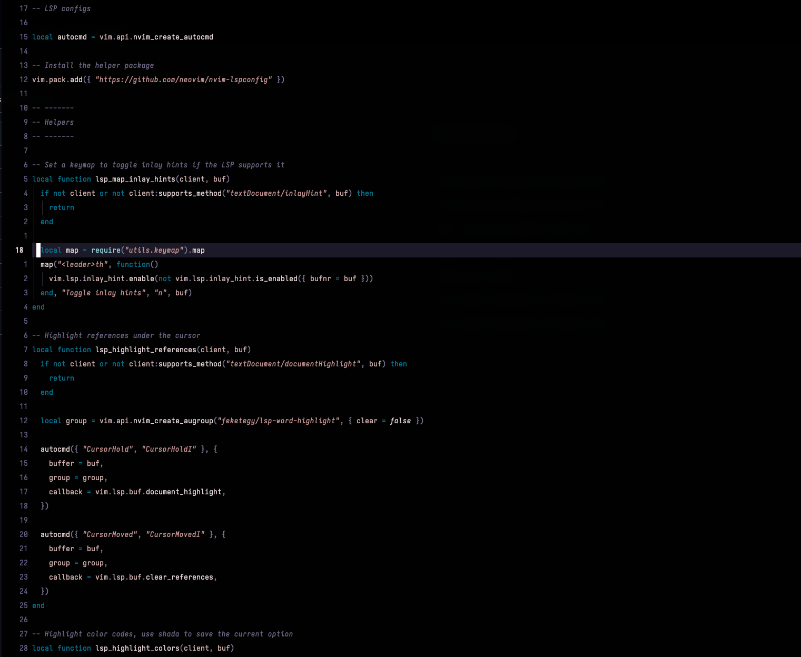
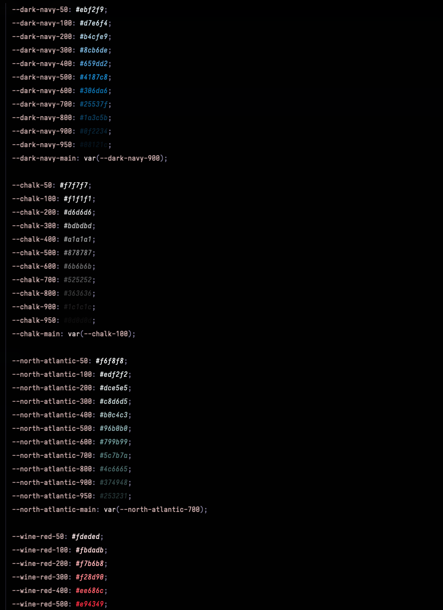
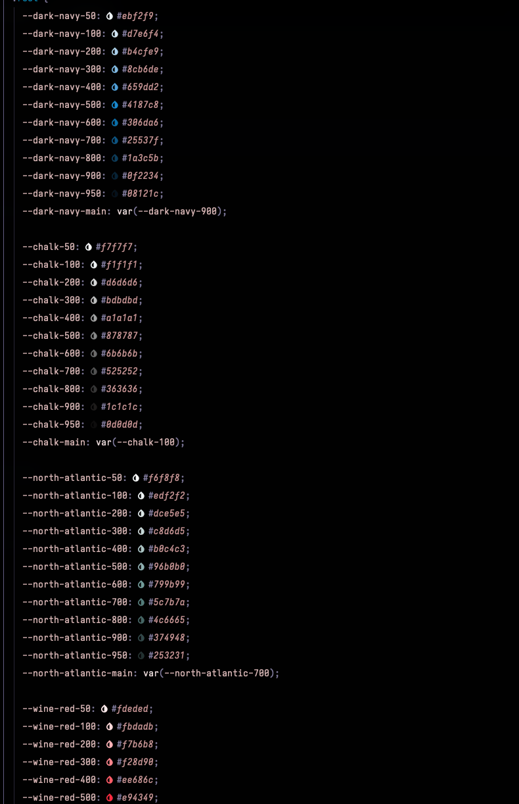
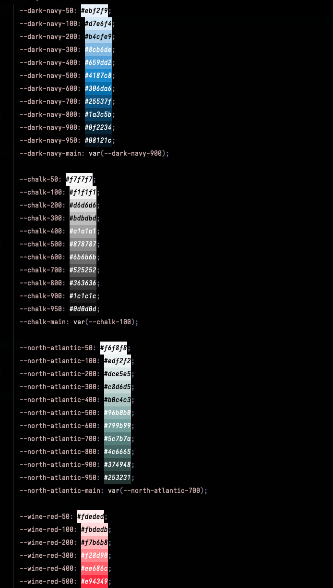

# Neovim dotfiles

- Theme: [zenbones.nvim](https://github.com/zenbones-theme/zenbones.nvim) rosebones variant.
- Font: [Primal Skill Term](https://github.com/feketegy/dotfiles/tree/main/fonts/primal-skill-term) custom build from [Iosevka](https://github.com/be5invis/iosevka)

--------

------

## Document Colors

This is enabled if the LSP supports it.

